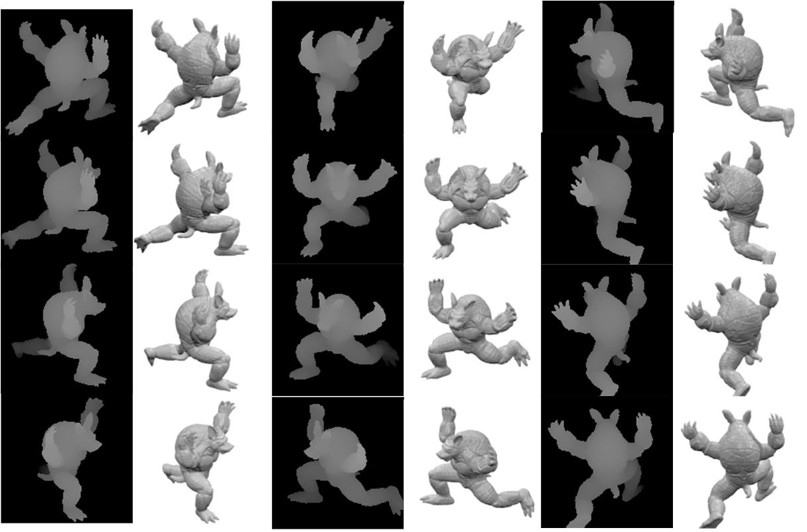

# MultiView_Depth_Dataset_Generator
This project is prepared for converting your 3D model dataset to a multi-view dataset.

Requirements:

-Python

-Blender

-Blender off-importer add-ons (https://github.com/alextsui05/blender-off-addon)

-ModelNet Dataset (http://modelnet.cs.princeton.edu)

Here is the results on a sample 3D model from 12 views with 12 depth-maps:

